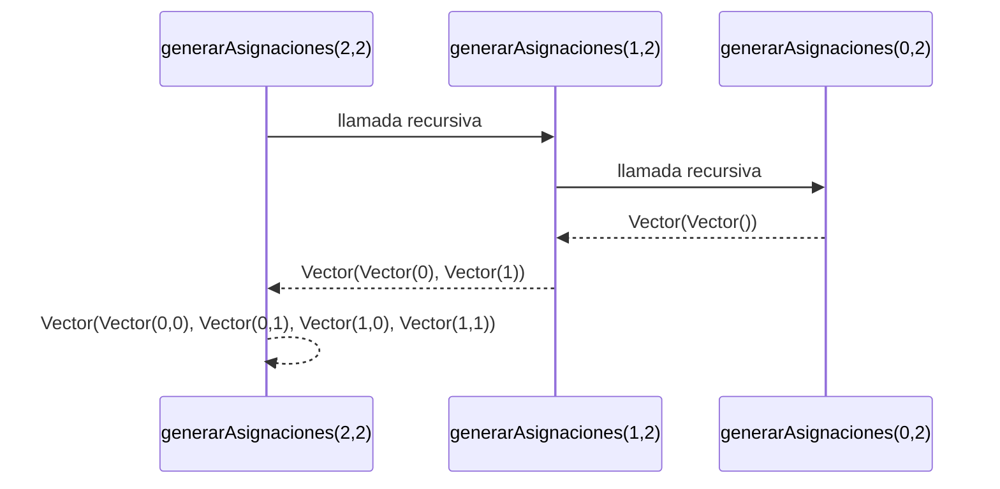
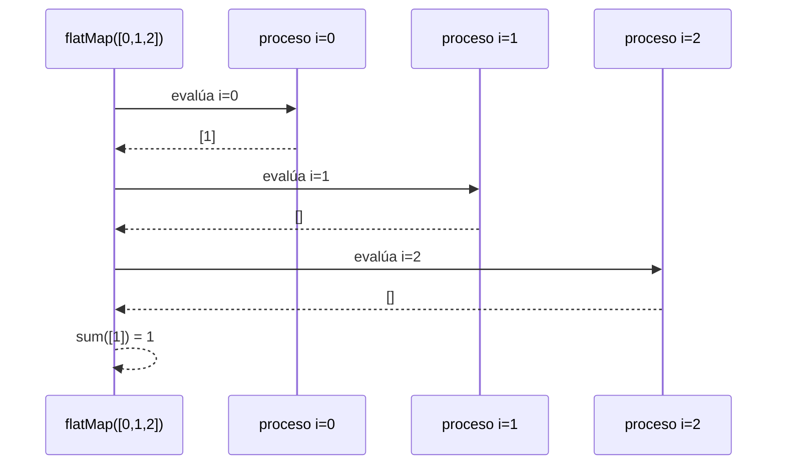

# Informe de Proceso

**Fundamentos de Programación Funcional y Concurrente**  
**Integrantes:** [completar]

---

## 1. `generarAsignaciones`

### Definición

```scala
def generarAsignaciones(n: Int, m: Int): Vector[Asignacion] =
  if (n == 0) Vector(Vector.empty)
  else
    generarAsignaciones(n - 1, m).flatMap(asig =>
      (0 until m).toVector.map(j => asig :+ j)
    )
```

La función es **recursiva lineal** sobre `n`: reduce el problema de tamaño `n` al de tamaño `n-1` y luego prefija cada valor posible de aula a cada asignación ya generada.

### Explicación paso a paso

**Caso base:** `n = 0`

No hay cursos que asignar: se devuelve un vector con una única asignación vacía.

```scala
generarAsignaciones(0, 2) → Vector(Vector())
```

**Caso recursivo:** `n = k+1`

Se generan recursivamente todas las asignaciones de `k` cursos y luego se añade al final de cada una cada uno de los `m` valores posibles de aula.

```scala
generarAsignaciones(n - 1, m).flatMap(asig =>
  (0 until m).toVector.map(j => asig :+ j)
)
```

### Ejemplo: `generarAsignaciones(2, 2)`

#### Paso 1: llamada inicial

```scala
generarAsignaciones(2, 2)
```

#### Paso 2: llamada recursiva

```scala
generarAsignaciones(1, 2)
```

#### Paso 3: llamada recursiva

```scala
generarAsignaciones(0, 2)
→ Vector(Vector())   // caso base
```

#### Paso 4: despliegue n=1

```scala
Vector(Vector()).flatMap(asig => Vector(asig :+ 0, asig :+ 1))
→ Vector(Vector(0), Vector(1))
```

#### Paso 5: despliegue n=2

```scala
Vector(Vector(0), Vector(1)).flatMap(asig => Vector(asig :+ 0, asig :+ 1))
→ Vector(Vector(0,0), Vector(0,1), Vector(1,0), Vector(1,1))
```

### Diagrama de llamados



---

## 2. `choques`

### Definición

```scala
def choques(cursos: Cursos, a: Asignacion): Int =
  cursos.indices.toVector.flatMap { i =>
    cursos.indices.toVector
      .filter(j => j > i && a(i) >= 0 && a(j) >= 0 && a(i) == a(j))
      .map(j => if (solapan(cursos(i), cursos(j))) 1 else 0)
  }.sum
```

La función usa funciones de alto orden (`flatMap`, `filter`, `map`, `sum`) para recorrer todos los pares `(i, j)` con `i < j`. Internamente, `flatMap` aplica recursión lineal sobre el vector de índices.

### Ejemplo: `choques(c1, Vector(0, 0, 1))`

`c1 = [M01(4,8,25), M02(6,10,30), M03(12,16,20)]`, `a = [0, 0, 1]`

#### Paso 1: índice `i = 0`

Candidatos `j > 0` con `a(j) == a(0) = 0`: solo `j = 1` (pues `a(2) = 1 ≠ 0`).

```
solapan(M01[4,8), M02[6,10)) → 4 < 10 && 6 < 8 → true → 1
```

#### Paso 2: índice `i = 1`

Candidatos `j > 1` con `a(j) == a(1) = 0`: ninguno (`a(2) = 1`).

```
→ []
```

#### Paso 3: índice `i = 2`

No hay `j > 2`.

```
→ []
```

#### Paso 4: suma

```
sum([1]) = 1
```

### Diagrama de llamados (recursión interna de `flatMap`)



---

## 3. `asignacionOptima`

### Definición

```scala
def asignacionOptima(cursos: Cursos, aulas: Aulas, d: Distancias,
                     w: Pesos): (Asignacion, Int) =
  generarAsignaciones(cursos.length, aulas.length)
    .map(a => (a, costoAsignacion(cursos, aulas, d, a, w)))
    .minBy(_._2)
```

No es recursiva directamente: delega la generación del espacio de búsqueda a `generarAsignaciones` (recursiva, demostrada arriba) y luego aplica `map` + `minBy` sobre el vector resultante.

### Ejemplo: `asignacionOptima(c1, a1, d1, w)`

`c1` tiene 3 cursos, `a1` tiene 2 aulas → espacio de búsqueda: $2^3 = 8$ candidatas.

#### Paso 1: generar candidatas

```scala
generarAsignaciones(3, 2)
→ Vector(
    Vector(0,0,0), Vector(0,0,1), Vector(0,1,0), Vector(0,1,1),
    Vector(1,0,0), Vector(1,0,1), Vector(1,1,0), Vector(1,1,1)
  )
```

#### Paso 2: evaluar costos

```
map(a => (a, costoAsignacion(...)))
→ [([0,0,0], CT0), ([0,0,1], 1031), ([0,1,0], 37), ..., ([1,1,1], CTk)]
```

#### Paso 3: seleccionar mínimo

```
minBy(_._2) → asignación con menor costo
```

### Diagrama de llamados

```mermaid
sequenceDiagram
    participant OPT as asignacionOptima
    participant GEN as generarAsignaciones(3,2)
    participant MAP as map costoAsignacion
    participant MIN as minBy

    OPT->>GEN: generar 8 candidatas
    GEN-->>OPT: Vector[Asignacion] (8 elementos)
    OPT->>MAP: evaluar costo de cada una
    MAP-->>OPT: Vector[(Asignacion, Int)]
    OPT->>MIN: seleccionar mínimo
    MIN-->>OPT: (asignacionOptima, costoMinimo)
```

---

## 4. Funciones auxiliares no recursivas

Las funciones `solapan`, `capacidadFallida`, `desperdicio`, `movilidad` y `costoAsignacion` no son recursivas explícitas: delegan la recursión en las operaciones estándar de Scala sobre colecciones (`filter`, `map`, `sum`, `sortBy`, `zip`).

### Enfoque de funciones de alto orden

En lugar de escribir recursión manual, se encadenan transformaciones sobre colecciones inmutables:

```
índices → filter (condición) → map (transformación) → sum / minBy
```

Este enfoque es declarativo: se describe **qué** calcular, no **cómo** iterarlo.

### Ejemplo: `movilidad(c1, a1, d1, Vector(0,1,0))`

```
índices [0,1,2]
  → filter a(i)>=0     → [0, 1, 2]
  → sortBy iniCurso    → [0(4), 1(6), 2(12)]  // M01, M02, M03
  → zip con tail       → [(0,1), (1,2)]
  → map D[a(i)][a(j)]  → [D[0][1], D[1][0]] = [3, 3]
  → sum                → 6
```